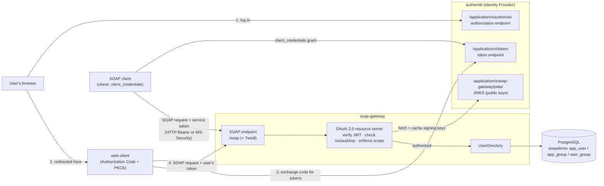
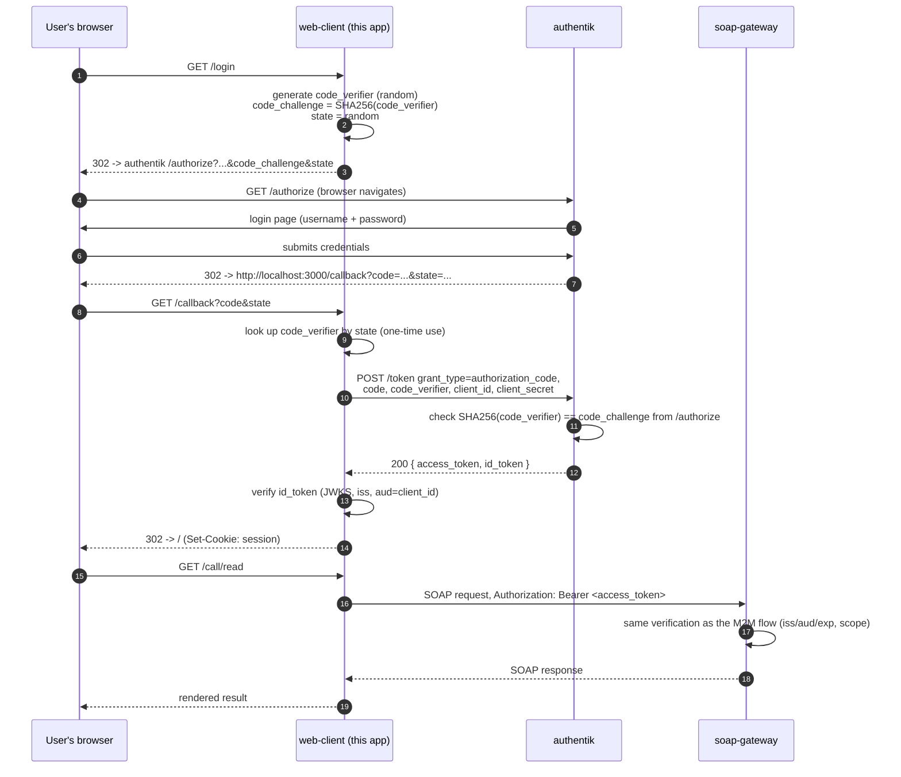

# Architecture

## Components



The gateway is a **resource server** in OAuth 2.0 terms: it never handles
credentials or runs a login UI, it only *consumes* access tokens — whether
they came from a service (`client/`, `client_credentials`) or from a human
who just logged in through authentik's own page (`web-client/`, Authorization
Code + PKCE). Token validation is local (offline) — the signing keys are
fetched from the JWKS endpoint once and cached, so there is no per-request
call to authentik.

## Sequence — token on the HTTP `Authorization` header (default)

```mermaid
sequenceDiagram
    autonumber
    participant C as SOAP client
    participant A as authentik
    participant G as soap-gateway

    C->>A: POST /application/o/token/<br/>grant_type=client_credentials, scope=user.read
    A-->>C: 200 { access_token (JWT), expires_in }
    C->>G: POST /soap<br/>Authorization: Bearer <JWT><br/>SOAP body: GetUserDisplayName
    G->>A: GET /jwks/  (first call only, then cached)
    A-->>G: { keys: [...] }
    G->>G: verify signature, iss, aud, exp; require scope "user.read"
    G-->>C: 200 SOAP: <GetUserDisplayNameResponse><displayName>…
```

## Sequence — Authorization Code + PKCE (`web-client/`, a human logs in)

The two sequences above are **client_credentials**: a service proves its own
identity, no human involved. `web-client/` adds the other OAuth 2.0 grant this
project demonstrates — a **browser** logging a **person** in, per RFC 6749
§4.1 with the RFC 7636 PKCE extension:



Two things worth noticing against the client_credentials sequence:

- **The password never reaches `web-client`.** It goes straight from the
  browser to authentik's own login page; this app only ever sees a `code`,
  then tokens.
- **PKCE replaces "prove you're a confidential client" with "prove you're the
  same party that started this login."** `code_verifier` is generated fresh
  per login and never leaves the server; only its hash (`code_challenge`)
  goes out in the (unauthenticated, redirectable) `/authorize` request. Even
  though this provider is confidential (has a `client_secret` too), using
  PKCE on top is current best practice (OAuth 2.1) precisely because the
  authorization step happens in a browser, where a redirect URI or the code
  itself is more exposed than a token-endpoint request from a backend.
- **The resource server (`soap-gateway`) cannot tell the difference.** Same
  JWKS check, same `iss`/`aud`/`exp`, same per-operation scope enforcement —
  which is the point of the resource-server pattern: it only trusts
  authentik's signature, not how the caller authenticated to get the token.

## Sequence — token inside the SOAP envelope (WS-Security)

```mermaid
sequenceDiagram
    autonumber
    participant C as SOAP client
    participant A as authentik
    participant G as soap-gateway

    C->>A: POST /application/o/token/ (client_credentials)
    A-->>C: 200 { access_token (JWT) }
    C->>G: POST /soap<br/>SOAP header:<br/>&lt;wsse:Security&gt;&lt;wsse:BinarySecurityToken&gt;base64(JWT)
    G->>G: read token from wsse:Security, then same verification + scope check
    G-->>C: 200 SOAP response  (or <soap:Fault> on failure)
```

The token is byte-for-byte the same JWT; only the carrier differs. The gateway
tries the HTTP header first and falls back to the WS-Security header
(`src/auth/authenticate.ts`).

## HTTP Bearer vs WS-Security — when to use which

| | HTTP `Authorization: Bearer` | WS-Security `BinarySecurityToken` |
|---|---|---|
| Where the token lives | HTTP transport header | inside `<soap:Header>` |
| Survives an intermediary that drops HTTP headers (ESB, queue, store-and-forward) | no | yes |
| Works with plain `curl` / any HTTP client | yes | needs a SOAP/WS-Security-aware client |
| Message can be signed so the token is bound to the body (XML-DSig) | no | yes (not implemented here — noted as an extension) |
| Complexity | minimal | XML namespaces, encoding types, optional canonicalisation |
| Recommendation | **default** for point-to-point HTTPS | only when headers are not end-to-end, or a WS-* policy requires it |

## Where this sits in the WS-* / OAuth history

Before OAuth 2.0, SOAP services that needed federated identity used
**WS-Trust**: a client asked a Security Token Service (STS) for a SAML
assertion and put that assertion in `<wsse:Security>`. The bridge between that
world and OAuth 2.0 is the **SAML 2.0 Bearer Assertion grant (RFC 7522)** — an
OAuth token endpoint that accepts a SAML assertion and returns an OAuth access
token (and **RFC 7523** does the same with a JWT assertion).

authentik does not implement WS-Trust/STS, so this project uses the modern
equivalent: authentik issues a normal OAuth 2.0 JWT access token, and the SOAP
service simply accepts that JWT — either on the HTTP header or, for
intermediary-friendliness, transported in the same `<wsse:Security>` element an
STS-issued token would have used.

## Security notes / hardening checklist

- **TLS everywhere.** A bearer token is a password-equivalent; never send it
  over plain HTTP outside a local demo.
- **Audience pinning.** The gateway rejects any token whose `aud` is not
  `soap-gateway`, so a token minted for another app cannot be replayed here.
- **Per-operation scopes.** `user.read` for reads, `user.write` for
  `DeactivateUser` (`src/soap/handlers.ts`).
- **No secrets in the image or compose file** — everything comes from `.env`
  (git-ignored) or Docker secrets.
- **JWKS caching + key rotation** handled by `jose`'s `createRemoteJWKSet`.
- **Schema validation.** node-soap validates the request against the WSDL/XSD;
  combined with a request-size limit this blunts malformed-XML / XXE attempts.
- **Structured audit logging** of `subject`, `operation`, `transport` on every
  authorized call (`pino`).
- Possible next steps: `mustUnderstand="1"` enforcement on the security header,
  XML-DSig message signing, RFC 7662 token introspection for instant
  revocation, rate limiting.
